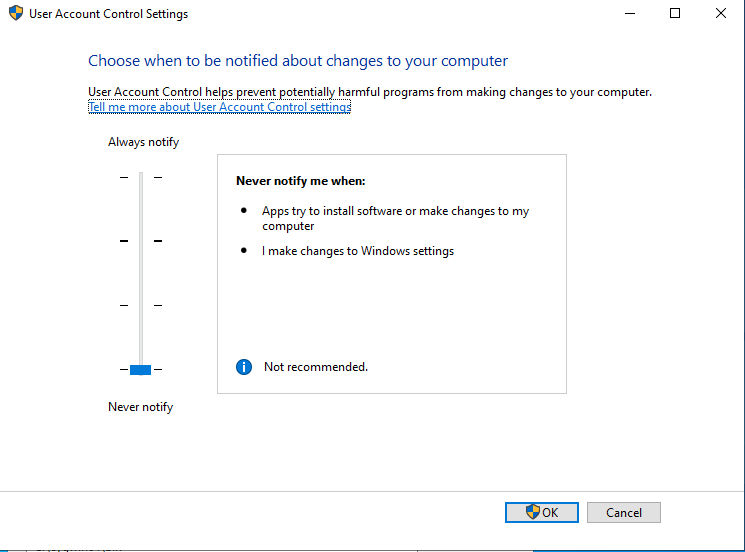
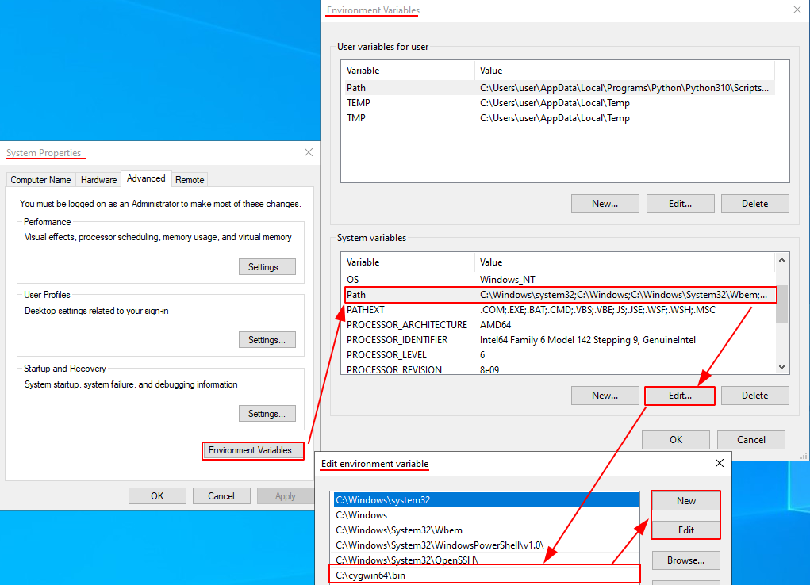

# HijackDiscovery
With this instrument, you can take a glance in to the Windows processes and identify potential hijack stepping stones. 


The application is mainly focusses on automatically discover DLL Search-order hijacks in Windows applications.  More details about the relevant issue is described [here](DETAILS.md).

Currently two modes are supported {monitor/analyse} 
- Monitor mode intents to discover the installation directory if case it is not directly clear (for example with Windows store applications). The directory option reduce the number of false positives.
- Analyse mode requires a target path and scans all DLL's and Executables recursively.

A demo video for the monitor mode can be found [here](assets/monitor-mode.mp4), and for analyse mode [here](assets/analyse-mode.mp4).


## Setup
---

Git clone

```bash
git clone https://github.com/MrPineMan/HijackDiscovery.git && cd HijackDiscovery
```

The setup script disables UAC to prevent interruptions and install the Cygwin64 compiler. For the Cygwin64 compiler, a PATH system environment variable is created.   

Run the setup script; 

```bash
Start-Process powershell -ArgumentList "-file setup.ps1"
```
Verify the test setup with the following screenshots;






## Commands
---
The `main.py` application supports the following arguments:

| Option      | Description | Required |
| ----------- | ----------- | ----------- |
| -h/--help     | Manual page | No | 
| --version   | Application version | No |
|-d/--debug| Enable debug mode | No |
|-a/-appname| Output folder name | Yes |
|monitor/analyse| Different modes | Yes | 

The `monitor mode` supports the following arguments:
| Option      | Description | Required |
| ----------- | ----------- | ----------- |
| -h/--help     | Manual page | No | 
| -d/--directory | Target path to monitor (recursively) | Yes | 

The `analyse mode` supports the following arguments:
| Option      | Description | Required |
| ----------- | ----------- | ----------- |
| -h/--help     | Manual page | No | 
| --installdir | Target path to analyse (recursively) | Yes | 


---
### monitor mode
```bash
python main.py -a "MyApplication" monitor --directory "C:\\Program Files\\" 
```


### analyse mode
```bash
python main.py -a "System32" analyse --installdir "C:\\windows\\system32"
```
---


### Examples
| Item | Description |
| ---- | ----------- |
| [`WinServ2022.csv`](assets/WinServ2022.csv) | Windows server 2022 System32 folder unique results (include AutoElevate property to bypass UAC with trusted path mocking) |
| [`WinServ2022.xlsx`](assets/WinServ2022.xlsx) | More readable xlsx version |
| [`GoogleChrome.csv`](assets/GoogleChrome.csv) | Google Chrome example |


### TODO: 
- Support more hijacking types, .sys, HIVES, config files etc.
- Proper error logging
- Change output formats
- Intergrate analyse-results in main flow


## CREDITS

Big credits to Wietze beukema and [his detailed blog post](https://wietze.github.io/blog/hijacking-dlls-in-windows)! 


